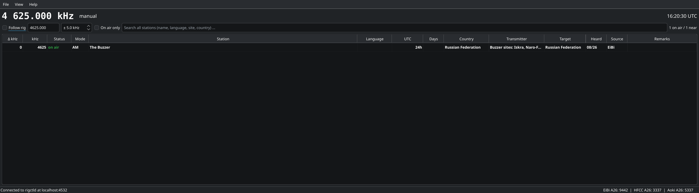

# On The Dial (otd)

*Who is on the frequency I am tuned to?*

On The Dial, `otd` for short, is a small desktop program for shortwave listeners. It follows the
VFO of your receiver through Hamlib's `rigctld` and shows which stations are
scheduled on or near that frequency right now: broadcasters, utility stations,
time signals, and oddities such as *The Buzzer* on 4625 kHz.



## Download

Ready-made builds, no installation needed:

- Windows 10/11 (64-bit): [otd-1.0.0-windows-x64.zip](https://onthedial.oh2gba.eu/downloads/otd-1.0.0-windows-x64.zip), unzip and start `otd.exe`. Hamlib's rigctld is included.
- Linux (64-bit): [otd-1.0.0-x86_64.AppImage](https://onthedial.oh2gba.eu/downloads/otd-1.0.0-x86_64.AppImage), `chmod +x` and run. Needs the distribution's Hamlib package for rigctld.
- macOS 12 or newer (Apple Silicon and Intel): `otd-<version>-macos.dmg` from the
  [GitHub releases](https://github.com/oh2gba/onthedial/releases). The app is not notarized, so on
  first start right-click it and choose Open. Install rigctld with `brew install hamlib`.
- Checksums: [SHA256SUMS.txt](https://onthedial.oh2gba.eu/downloads/SHA256SUMS.txt). The same files are attached to the GitHub releases.

How to hook up the radio: <https://onthedial.oh2gba.eu/rig.html>

## Features

- Follows the rig via `rigctld` (default `localhost:4532`), reconnects automatically. Also works
  with gqrx's remote control and SDR++'s rigctl server, since the plain rigctl protocol is used.
- Can start `rigctld` for you: pick the rig model, port and baud rate under *File → Settings → Radio*.
- Manual mode: untick *Follow rig* and type a frequency, or start with `--frequency 4625`.
- Live status per entry: **on air** (bold), *maybe* (irregular schedules), off, inactive.
  Evaluated against UTC, including broadcasts crossing midnight, weekday rules
  such as `Mo-Fr`, `1.Sa`, `Last7`, `15Sep`, `MF-15`, validity dates and
  summer/winter-only entries.
- Adjustable search width (± kHz), *On air only* toggle, free-text filter.
- Search: type "buzzer" and the whole database is searched, on-air hits first with
  their distance from the tuned frequency. Double-click a row to tune the rig to it
  (frequency and mode via rigctld); without a rig the view jumps there instead.
- Mode column (AM, USB, LSB, CW, DRM, RTTY, FAX, HFDL) derived from each source's markers.
- Personal list: add your own identifications (Stations menu or right-click), edit, delete,
  import and export as CSV. They appear with source "Mine" and live in the same database.
- Right-click a row for the matching sigidwiki.com page of the mode, or a wiki search for the station.
- Three sources side by side, each switchable: EiBi, HFCC and Aoki. The *Source*
  column tells them apart.
- Codes resolved to names: language, country, transmitter site (including relays,
  e.g. "Moosbrunn (Austria)") and target area.
- Data is stored in a local SQLite database and refreshed at most once a week.
  Refresh requests use `If-Modified-Since`, so an unchanged file costs a single
  tiny 304 response.
- Everything, including settings, window size and column layout, lives in one SQLite
  file. `--data-dir <dir>` puts it wherever you like (portable mode).

## Data sources

| Source | Status | Notes |
| --- | --- | --- |
| [EiBi](http://www.eibispace.de/) by Eike Bierwirth | included | README states the lists are free to use in third-party software. Thank you, Eike! |
| [HFCC](http://www.hfcc.org/data/) public data files | included | official broadcaster registrations per season, zipped fixed-width text |
| Aoki / Bi Newsletter ([NDXC](http://www1.s2.starcat.ne.jp/ndxc/)) | included | the season zip is located through the index page, since its directory changes |


## Building

Everything builds inside Docker, so nothing needs to be installed on the host
except Docker itself. The resulting binary links against the Qt 6.8 runtime of
Debian 13 (trixie); it runs natively on a trixie/KDE desktop.

```bash
./build.sh            # configure, build and run the unit tests
./build/otd     # run it
```

Options: `--no-test` skips the tests, `--clean` starts from scratch.

Ready-made packages, both produced in Docker as well:

```bash
./package-linux.sh      # dist/otd-<version>-x86_64.AppImage (Ubuntu 22.04 base, Qt 6.8)
./package-windows.sh    # dist/otd-<version>-windows-x64.zip (MinGW cross build, bundles rigctld)
```

The Windows zip ships Hamlib's `rigctld` (LGPL) so users need nothing else;
the AppImage expects `rigctld` from the distribution's Hamlib package.

Without Docker you need CMake ≥ 3.21, Ninja and Qt 6 (Widgets, Network, Sql,
Test) and can build the usual way:

```bash
cmake -S . -B build -G Ninja && cmake --build build && ctest --test-dir build
```

## Running

```bash
./build/otd                         # follow rigctld on localhost:4532
./build/otd --frequency 4625        # manual mode at 4625 kHz
./build/otd --data-dir ./data-local # portable: keep everything here
```

Settings (rigctld host/port, poll interval, search width, refresh interval,
sources and their URLs) are under *File → Settings* and are stored in the
same `stations.db` as the schedules. Without `--data-dir` that file lives in
`~/.local/share/otd/` on Linux.

`--screenshot <file>` saves a picture of the window after a few seconds and
exits; it exists for documentation.

Note for Wayland users: the window size is restored, but a Wayland compositor
does not let applications choose their position. KWin can remember it for you
via a window rule for "otd".

## Flatpak

`flatpak/eu.oh2gba.onthedial.yml` builds the app together with Hamlib on the KDE 6.8
runtime, so rigctld is available inside the sandbox:

```bash
flatpak-builder --user --install --force-clean build-flatpak flatpak/eu.oh2gba.onthedial.yml
flatpak run eu.oh2gba.onthedial
```

The same manifest is what a Flathub submission needs, together with the AppStream
metainfo in `data/`.

## Web page and source

Source code: <https://github.com/oh2gba/onthedial>


The project page lives at <https://onthedial.oh2gba.eu/>. Its files are in
`site/` and `./deploy.sh` uploads them over FTP with TLS. The credentials are
read from `.env`, which is git-ignored and must stay that way:

```
FTP_HOST=...
FTP_USER=...
FTP_PASS='...'
SITE_HOST=onthedial.oh2gba.eu
```

## Project layout

```
src/core/   parsers (EiBi, HFCC, Aoki), schedule evaluation, SQLite store, rigctld client, downloaders (no GUI)
src/app/    Qt Widgets user interface
tests/      QtTest unit tests for the core
docker/     build image (Debian trixie + Qt 6)
data/       desktop entry and icon
site/       project web page, deployed with ./deploy.sh
third_party/miniz   zip extraction (MIT), bundled
```

## License

GPL-3.0-or-later. Bundled miniz is MIT licensed. Schedule data remains the
property of its respective publishers; see *Data sources*.
